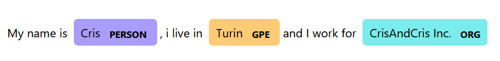

# huggingface-transformers
Experiments with transformers library

Create a new venv:

_cd PROJ_DIR_

_python -m venv venv_

Before starting, we need to install required libraries

_pip install torch_

_pip install transformers_

_python -m spacy download en_core_web_sm_

_pip install sentencepiece_

pipeline() function is the simplest trasnformers function that can be used;
its constructor defines the context for which we want to use it:

**sentiment analysis**

classifier = pipeline("sentiment-analysis")

result1 = classifier("I love using Hugging Face transformers!")

print(result1)

_#[{'label': 'POSITIVE', 'score': 0._9971315860748291}]_

result2 = classifier("This is the worst experience I've ever had.")

print(result2)

_#[{'label': 'NEGATIVE', 'score': 0.9997679591178894}]_

**zero-shot classification**

zero-shot-classification maps a sentence to a category and gives 

a score according to how much the sentence is related to the category:

zsc=pipeline("zero-shot-classification")

result4 = zsc("Juventus won yesterday", 
    candidate_labels=["technology", "sports", "politics"])

print(result4)

_#{'sequence': 'Juventus won yesterday', 'labels': ['sports', 'technology', 'politics'], 'scores': [0.9163153171539307, 0.0478145033121109, 0.03587019070982933]}_

**text-generation**

text-generation completes text according to items like max_new_tokens,max_lengths:

generator = pipeline("text-generation", model="gpt2")

result5 = generator("In a distant future, humanity has", 
                    max_new_tokens=30,max_length=30, num_return_sequences=2)

print(result5)

_#[{'generated_text': 'In a distant future, humanity has not evolved to be a full sentient species—that is, to be a species of sentient beings with a human heart. In this way, it is'}, {'generated_text': "In a distant future, humanity has a great deal of potential, but also a lot of work to do before we know what kind of future we're in.\n\nDo you know"}]_

**ner (Named Entity Recognition)**

NER recognizes persons, companies, places names and highlights them; using spacy, we get an awesome output:

**translation**

According to a chosen model, we can have a translation of a phrase from a language to another:

translate=pipeline("translation", model="Helsinki-NLP/opus-mt-en-es")

result7 = translate("Hugging Face is creating a tool that the community uses to solve NLP tasks.")

print(result7)

_#[{'translation_text': 'Hugging Face está creando una herramienta que la comunidad utiliza para resolver las tareas de NLP.'}]_

translate_it=pipeline("translation", model="Helsinki-NLP/opus-mt-en-it")

result8 = translate_it("Hugging Face is creating a tool that the community uses to solve NLP tasks.")

print(result8)

_#[{'translation_text': 'Hugging Face è la creazione di uno strumento che la comunità utilizza per risolvere le attività NLP.'}]_
#italian translation is not so correct ....

